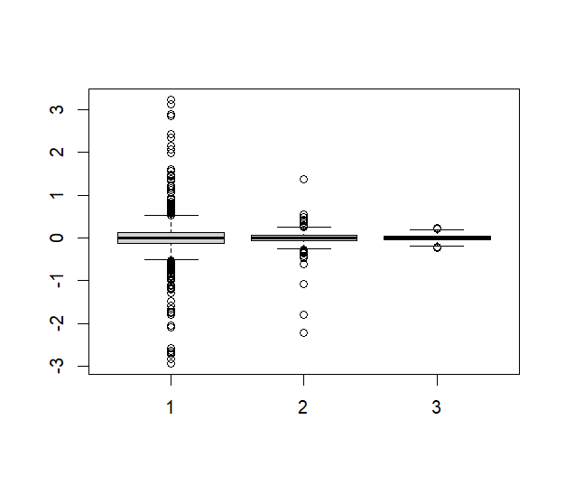
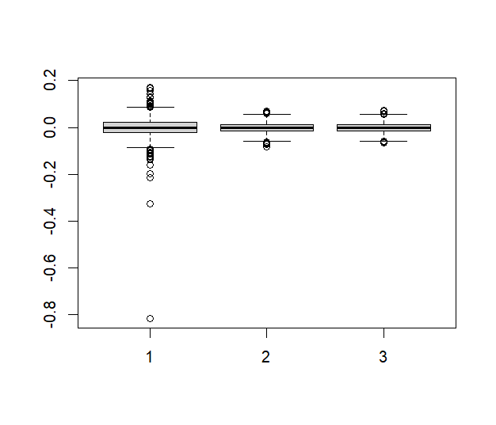
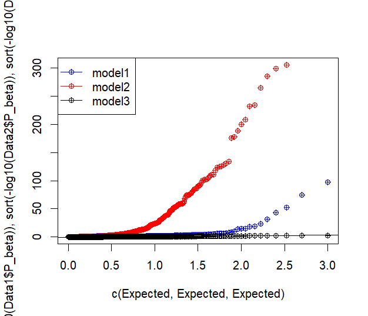
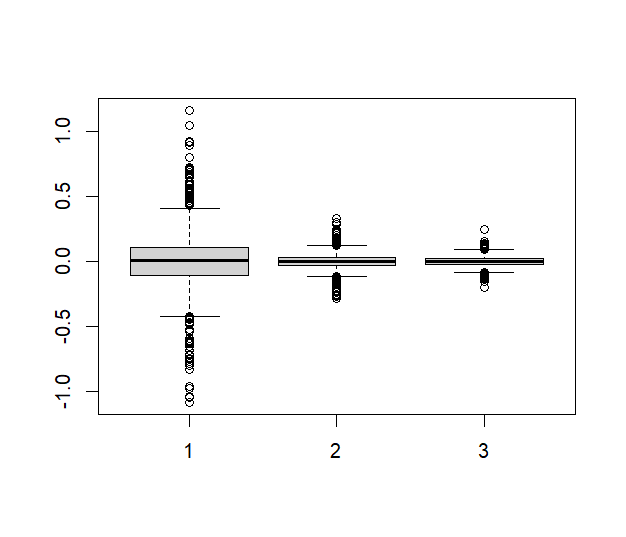
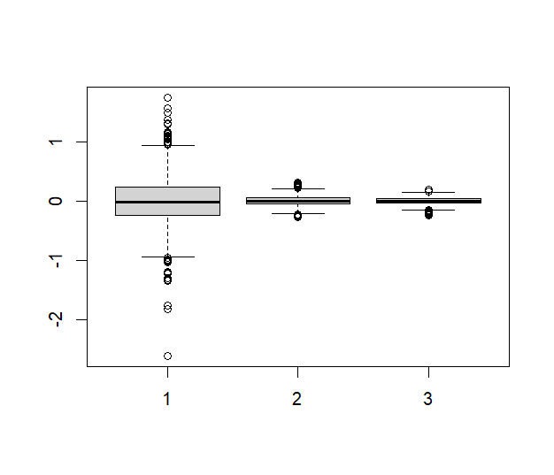
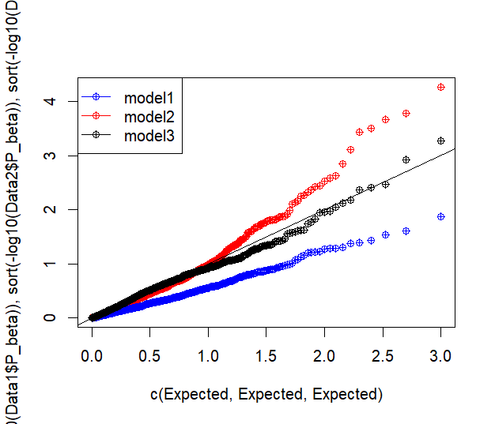

# 加权线性回归

这是一篇自我疑惑解答的博客，我写完整理后希望也可以帮到和我有一样疑惑的人，这篇博客包含的内容简要：

- 加权线性回归是什么、它与线性回归的差别，以及参数求解；
- 加权线性回归应该如何有效地加权？如何确保权重的正确性？
  - 列举了两个需要加权的数值例子；
  - 探讨如何有效加权；
- 总结：确保满足同分布特性实现有效加权（针对R包中的 `lm()`）


## 1 加权线性回归与普通线性回归

### 普通线性回归

对于 $N$ 个观测数据
$$
(X_i,y_i), i=1,2,3,\cdots,N
$$
可以使用线性回归模型
$$
y = \beta X + \theta + \epsilon
$$
来拟合 $X$ 和 $y$ 之间的关系。其中的参数 $\beta,\theta$ 通常使用最小二乘拟合，即按照使代价函数
$$
J(\beta,\theta) = \frac{1}{N} \sum_{i=1}^N (y_i - \beta X_i - \theta)^2
$$
最小的 $\hat \beta,\hat \theta$，使得拟合曲线尽可能地接近所有的观测点。

### 加权线性回归

但在实际应用中，观测点之间可能是由差异的。比如，有的观测点误差大，有的观测点误差小，这就需要让拟合直线 $y = \beta X + \theta$ 优先拟合误差较小的观测点。这时我们就可以使用一个权重系数 $w_i$ 来表示第 $i$ 个观测点的权重 (例如，对于误差小的观测点，$w_i$ 的值更大) 考虑了这个权重系数的 $w_i$ 的线性回归，就是加权线性回归。

它的回归方差仍然是 $y = \beta X + \theta + \epsilon$，唯一的区别是代价函数变成了
$$
J(\beta,\theta) = \frac{1}{N} \sum_{i=1}^N w_i (y_i - \beta X_i - \theta)^2
$$
 这样，我们在寻找最优 $\beta,\theta$ 时，就可以更多地考虑高权重的观测值。

## 2 参数求解

这里不考虑太难的了，就考虑一个自变量 $x_i$ 理解求解过程就好了:
$$
\hat \beta, \hat \theta = arg\min_{\hat \beta,\hat \theta} J(\beta,\theta)
$$
$J$ 的值一定是大于 0 的，且只有一个极值点，定然为最小值，所以可以采用求偏导的方式求极值点所在位置：
$$
\frac{\partial J}{\partial \beta}  = 0 \\
\frac{\partial J}{\partial \theta}  = 0
$$
求解过程并不复杂，这里我给出最终结果：
$$
\hat \beta = \frac{\sum_i^N w_i x_i y_i - \frac{\sum_i^N w_i y_i \cdot \sum_i^N w_i x_i}{\sum_i^N w_i}}
{\sum_i^N w_i x_i^2 - \frac{(\sum_i^N w_i x_i)^2}{\sum_i^N w_i}} \\ 
\hat \theta = \frac{\sum_i^N w_i y_i - \hat \beta \sum_i^N w_i x_i}
{\sum_i^N w_i}
$$
*Note: 很多博客为了简洁，喜欢用其它符号替代，但我更喜欢这样写在一起（除非参数非常多），这样更能理解线性回归参数和数据的关系。*

## 3 实际例子

我参考的加权线性回归博客大部分到参数求解就结束了，对于线性回归中的显著性检验讨论甚少，至于为什么使用推荐的权重，为什么常用反向方差加权，这些问题一直困扰着我。下面我用两个数值例子阐述**不加劝和不正确加权**可能导致的问题、以及为什么加权线性回归中常用方差的倒数($1/\sigma^2$)进行加权，何种情况需要使用其它类型的权重？

### 3.1 ‘比例数值’ 回归

**场景：**有两个服从正态分布的随机变量 $X$ 和 $Y$，还有一组观测数据 $U$ （非随机变量，确定值），需要对 Y/U 和 $X/U$ 进行线性回归。

这里我模拟了三种线性模型进行估计，包括一般线性回归1、 加权线性回归2($|U|$) 和加权线性回归3($U^2$)。我简单地列举了它们的相关参数以及统计推断的结果 (代码见下方)：


|                         斜率 $\beta$                         |                        截距 $\theta$                         |                       斜率的P值统计量                        |
| :----------------------------------------------------------: | :----------------------------------------------------------: | :----------------------------------------------------------: |
|  |  |  |

```R
set.seed(0)
Data1 = data.frame(theta = seq(1000),beta = seq(1000),P_beta=seq(1000))
Data2 =data.frame(theta = seq(1000),beta = seq(1000),P_beta=seq(1000))
Data3 = data.frame(theta = seq(1000),beta = seq(1000),P_beta=seq(1000))
    
for(i in seq(1000)){
    gamma = 0
    X = rnorm(200)
    Y = gamma * X + rnorm(200)
    U = abs(rnorm(200,3,1))
    
    Y_U = Y/U
    X_U = X/U
    
    model1 = summary(lm(Y_U~X_U))   
    model2 = summary(lm(Y_U~X_U,weights = U))   
    model3 = summary(lm(Y_U~X_U,weights = U^2))   
    
    Data1[i,] = c(model1$coefficients[,"Estimate"],model1$coefficients["X_U","Pr(>|t|)"])
    Data2[i,] = c(model2$coefficients[,"Estimate"],model2$coefficients["X_U","Pr(>|t|)"])
    Data3[i,] = c(model3$coefficients[,"Estimate"],model3$coefficients["X_U","Pr(>|t|)"])
}

boxplot(Data1$beta,Data2$beta,Data3$beta)
boxplot(Data1$theta,Data2$theta,Data3$theta)

Expected = sort(-log10(seq(1000)/1000))
plot(c(Expected,Expected,Expected),
     c(sort(-log10(Data1$P_beta)),sort(-log10(Data2$P_beta)),sort(-log10(Data3$P_beta))),
     col = c(rep("red",1000),rep("blue",1000),rep("black",1000)),
     pch=10)
legend("topleft", # 图例位置
       legend = c("model1", "model2", "model3"), # 图例名称
       col = c("blue", "red","black"), # 颜色
       pch = c(10, 10,10), # 点样式
       lty = c(1, 1)) # 线型
abline(b=1,a=0)
```

### 3.2 随机分布的因变量和自变量

**场景：**上个例子我们假设所有（自变量和因变量）数据都是来自独立同分布的正态分布，但实际由于数据来源不同，观测数据可能服从不同的正态分布，假设有 $N$ 个观测数据 $(x_i,y_i)$，每个观察数据都来自于不同的正态分布，即 $x_i \sim N(\overline x_i,\sigma^2_{xi}),y_i \sim N(\overline y_i,\sigma^2_{yi}),i =1,2,\cdots,N$ 。

这里我同样模拟了三种线性模型进行估计，包括一般线性回归1、 加权线性回归2($|\sigma_{yi}|^{-1}$) 和加权线性回归3($1/\sigma_{yi}^2$)。我简单地列举了它们的相关参数以及统计推断的结果 (代码见下方)：

|                         斜率 $\beta$                         |                        截距 $\theta$                         |                       斜率的P值统计量                        |
| :----------------------------------------------------------: | :----------------------------------------------------------: | :----------------------------------------------------------: |
|  |  |  |

这里模拟的是20个样本量，200个样本量似乎样本量足够，不同模型没有区别。

```R
set.seed(0)
Data1 = data.frame(theta = seq(1000),beta = seq(1000),P_beta=seq(1000))
Data2 =data.frame(theta = seq(1000),beta = seq(1000),P_beta=seq(1000))
Data3 = data.frame(theta = seq(1000),beta = seq(1000),P_beta=seq(1000))

N = 20 # 200
for(i in seq(1000)){
    gamma = 0
    X_mean = rnorm(N)
    sd_X = rchisq(N,1) + 0.1
    X = rnorm(N,X_mean,sd_X)
    
    mean_Y = gamma * X_mean
    sd_Y = rchisq(N,1) + 0.1
    Y = mean_Y + rnorm(N,0,sd_Y)
    
    model1 = summary(lm(Y~X))
    model2 = summary(lm(Y~X,weights = abs(sd_Y)^-1))   
    model3 = summary(lm(Y~X,weights = sd_Y^-2))   
    
    Data1[i,] = c(model1$coefficients[,"Estimate"],model1$coefficients["X","Pr(>|t|)"])
    Data2[i,] = c(model2$coefficients[,"Estimate"],model2$coefficients["X","Pr(>|t|)"])
    Data3[i,] = c(model3$coefficients[,"Estimate"],model3$coefficients["X","Pr(>|t|)"])
}

boxplot(Data1$beta,Data2$beta,Data3$beta)
boxplot(Data1$theta,Data2$theta,Data3$theta)

Expected = sort(-log10(seq(1000)/1000))
plot(c(Expected,Expected,Expected),
     c(sort(-log10(Data1$P_beta)),sort(-log10(Data2$P_beta)),sort(-log10(Data3$P_beta))),
     col = c(rep("red",1000),rep("blue",1000),rep("black",1000)),
     pch=10)
legend("topleft", # 图例位置
       legend = c("model1", "model2", "model3"), # 图例名称
       col = c("blue", "red","black"), # 颜色
       pch = c(10, 10,10), # 点样式
       lty = c(1, 1)) # 线型
abline(b=1,a=0)

```

## 4. 如何有效加权？

加权线性回归提出就是为了优先拟合某些观测更准确的点，但权重该如何决定? 哪种权重（确保统计推断时）有效？对于权重的类型多种多样，这个可以根据实际情况自行决定，**这里我们主要讨论如何加权可以确保最终统计分析的有效性。**

在简单线性回归（没有加权），线性回归的参数$(\hat \beta,\hat \theta)$都是无偏估计，且服从正态分布。在加权线性回归进行统计分析，我们也需要确保我们估计的参数 $(\hat \beta,\hat \theta)$ 是无偏估计，且服从正态分布。

- **首先验证正态分布**：在一般线性回归中，我们一般将自变量看作固定的，只考虑因变量的随机性，即使是加权线性回归也是如此。在上面 $(\hat \beta,\hat \theta)$ 的估计表达式中，都是对 $y_i$ 的线性组会，而 $y_i$ 是正态分布（**正态性假设**），因此 $(\hat \beta,\hat \theta)$ 也都是服从正态分布。

- **证明无偏估计**，即验证均值$E(\hat \beta) = \beta$，这里我们以 $\hat \beta$ 为例：
  $$
  E(\hat \beta) = E(\frac{\sum_i^N w_i x_i y_i - \frac{\sum_i^N w_i y_i \cdot \sum_i^N w_i x_i}{\sum_i^N w_i}}
  {\sum_i^N w_i x_i^2 - \frac{(\sum_i^N w_i x_i)^2}{\sum_i^N w_i}}) \\ 
  = E( \frac{\sum_i^N w_i x_i (\beta X_i + \theta) - \frac{\sum_i^N w_i (\beta X_i + \theta) \cdot \sum_i^N w_i x_i}{\sum_i^N w_i}}
  {\sum_i^N w_i x_i^2 - \frac{(\sum_i^N w_i x_i)^2}{\sum_i^N w_i}}) \\
  = \beta
  $$

要进行统计推断还有最重要的一步，计算方差 $var(\hat \beta)$: 
$$
Var(\hat \beta) = Var(\frac{\sum_i^N w_i x_i y_i - \frac{\sum_i^N w_i y_i \cdot \sum_i^N w_i x_i}{\sum_i^N w_i}}
{\sum_i^N w_i x_i^2 - \frac{(\sum_i^N w_i x_i)^2}{\sum_i^N w_i}}) \\ 
= Var(\frac{\sum_i^N w_i \cdot \sum_i^N w_i x_i y_i - \sum_i^N w_i y_i \cdot \sum_i^N w_i x_i}
{\sum_i^N w_i\cdot \sum_i^N w_i x_i^2 - (\sum_i^N w_i x_i)^2})
$$
这里公式实在太多了，我把 $\sum_i^N w_i$ 和 $\sum_i^N w_i x_i$ 分别简写为 $\overline w$ 和 $\overline {wx}$、分母 $\sum_i^N w_i\cdot \sum_i^N w_i x_i^2 - (\sum_i^N w_i x_i)^2$ 简写为 $D$: 
$$
Var(\hat \beta) = Var(\frac{\overline w \cdot \sum_i^N w_i x_i y_i - \sum_i^N w_i y_i \cdot \overline {wx}}{D}) \\
= Var(\frac{\sum_i^N (\overline w x_i - \overline {wx}) w_i\epsilon_i }{D})
$$
**Note**: 虽然 $\epsilon_i$ 是服从正态分布，这里的方差很容易估计，但我们需要注意在 R 语言的 `lm()` 以及 python 的 `StatsModels` 中，它们估计这个方差基于特定形式：

1. 首先是加权线性回归残差和权重的关系：

   (加权)最小二乘 $\sum_{i=1}^N w_i (y_i - \beta X_i - \theta)^2$ 在统计分析中的意义是不可解释的残差最小，即 $\sum_{i=1}^N \sigma_i^2$。因此
   $$
   \sigma_i^2 = w_i (y_i - \beta X_i - \theta)^2
   $$

2. 第二是它们依然假设独立同分布：

   与普通线性回归的一样，这里的加权线性回归也需要假设独立同分布，但不同的地方在于加权线性回归计算的正态分布的的方差包含权重（$\sigma_i^2 = w_i (y_i - \beta X_i - \theta)^2$），要求 $w_i (y_i - \beta X_i - \theta)^2 = w_j (y_j - \beta X_j - \theta)^2, i\ne j$。而一般的线性回归要求的同分布是 $(y_i - \beta X_i - \theta)^2 = (y_j - \beta X_j - \theta)^2, i\ne j$。

   因此在加权线性回归中，最终残差方差会被估计为 $Se = \frac{\sum_i w_i (y_i - \beta X_i - \theta)^2}{N-2}$。

在这两个假设下，继续前面的方差推导可以得到：
$$
Var(\hat \beta) = Var(\frac{\sum_i^N (\overline w x_i - \overline {wx}) w_i\epsilon_i }{D}) \\
= \frac{\sum_i^N ((\overline w x_i - \overline {wx}) \sqrt{w_i} )^2}{D^2} var(\sqrt{w_i}\epsilon_i) \\
= \frac{\sum_i^N (\overline w x_i - \overline {wx})^2 w_i }{D^2} \cdot Se
$$


## 5 总结

在提到前面推导，以及Note的两个假设中，说明了为什么要使用方差的倒数进行加权了，这里结合我的数值例子说明：

- 在第一个例子中，虽然随机变量 $Y$ 的观察值都是服从独立同正态分布，但 $Y/U$ 则不再是服从相同的分布了，使用普通的线性回归自然会产生偏差。而考虑了加权线性回归，使用方差的倒数进行加权，也就是 $w_i = u_i^2$，此时加权后的 $w_i \cdot var(y_i/u_i) = w_j \cdot var(y_j/u_j), i\ne j$ ，满足加权线性回归的同分布条件，因此有效。
- 第二个例子也和第一个例子类似，使用方差倒数进行加权可以是加权线性回归满足同分布条件。
- 写完这个，让我基本弄明白了在加权线性回归 `lm()` 中，通过**确保加权后保持同分布（ $w_i \cdot var(y_i/u_i) = w_j \cdot var(y_j/u_j), i\ne j$）来选择确定权重。**
- 实际上，R包中的`lm()`这类函数只是加权线性回归的通用形式，在正态分布下，**即使完全不加权或者随意加权，估计的参数也是服从正态分布，只是 `lm()` 对方差的估计产生了偏差。**我们完全可以自己推导相关的方差进行统计分析，特别是在一些非线性加权（比如权重会随着 $y_i$ 大小变化而变化），这种自己推导将非常有效。

这里的证明论述也有一点需要注意：**在验证线性回归的参数服从正态分布时，更一般的证明是使用中心极限定理证明**，它还可以用来证明因变量不服从正态分布的广义线性回归，估计参数依然服从正态分布。前提是有足够的样本量。在我们的第二个例子，样本量较大（>200）,不加权的方法也有效，但样本量只有20时就会存在偏差。第一个例子可能就必须使用加权了，因为$Y/U$分布是随着样本变化而变化。当将 $U$ 固定在一定范围，当样本量越来越大时，最终不加劝也会有效。

## 6 参考

> 这个加权线性回归的原理推到是基于机器学习：https://xg1990.com/blog/archives/164
>
> 关于统计分析的问题参考了StackExchange上的一篇问答篇：https://stats.stackexchange.com/questions/138938/correct-standard-errors-for-weighted-linear-regression


