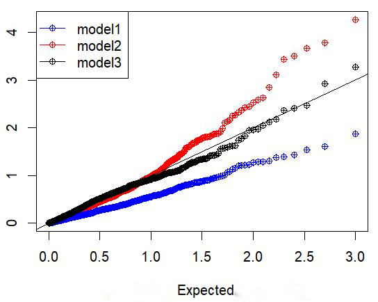

对于 $N$ 个观测数据

$$
(X_i,y_i), i=1,2,3,\cdots,N
$$

可以使用线性回归模型

$$
y = \beta X + \theta + \epsilon
$$

来拟合 $X$ 和 $y$ 之间的关系。其中的参数 $\beta,\theta$ 通常使用最小二乘拟合，即按照使代价函数

$$
J(\beta,\theta) = \frac{1}{N} \sum_{i=1}^N (y_i - \beta X_i - \theta)^2
$$

最小的 $\hat \beta,\hat \theta$，使得拟合曲线尽可能地接近所有的观测点，这就是**一般的线性回归**。

## 加权线性回归

但在实际应用中，观测点之间可能是由差异的。比如，有的观测点误差大，有的观测点误差小，这就需要让拟合直线 $y = \beta X + \theta$ 优先拟合误差较小的观测点。这时我们就可以使用一个权重系数 $w_i$ 来表示第 $i$ 个观测点的权重 (例如，对于误差小的观测点，$w_i$ 的值更大) 考虑了这个权重系数的 $w_i$ 的线性回归，就是加权线性回归。

它的回归方差仍然是 $y = \beta X + \theta + \epsilon$，唯一的区别是代价函数变成了

$$
J(\beta,\theta) = \frac{1}{N} \sum_{i=1}^N w_i (y_i - \beta X_i - \theta)^2
$$

 这样，我们在寻找最优 $\beta,\theta$ 时，就可以更多地考虑高权重的观测值。

## 参数求解

这里以一个自变量 $x_i$ 理解求解过程为例:

$$
\hat \beta, \hat \theta = arg\min_{\hat \beta,\hat \theta} J(\beta,\theta)
$$

$J$ 的值一定是大于 0 的，且只有一个极值点，定然为最小值，所以可以采用求偏导的方式求极值点所在位置：

$$
\frac{\partial J}{\partial \beta}  = 0 \\
\frac{\partial J}{\partial \theta}  = 0
$$

求解过程不复杂，最终结果如下：

$$
\hat \beta = \frac{\sum_i^N w_i x_i y_i - \frac{\sum_i^N w_i y_i \cdot \sum_i^N w_i x_i}{\sum_i^N w_i}}
{\sum_i^N w_i x_i^2 - \frac{(\sum_i^N w_i x_i)^2}{\sum_i^N w_i}} \\ 
\hat \theta = \frac{\sum_i^N w_i y_i - \hat \beta \sum_i^N w_i x_i}
{\sum_i^N w_i}
$$

*Note: 这里用其它符号替代减缓，这样写在一起更能理解线性回归参数和数据的关系。*

大部分博客对加权线性回归的重点关注参数估计，对加权影响参数检验的关注不够。权重代表数据点的重要性，在加权凸显部分数据的重要性时，这也会影响后续的参数显著性检验。我在实际应用（以`lm()`为例）分析数据的过程，发现加权可能导致假阳性，或者使参数检验的结果偏保守。

## 两个影响显著性检验的加权案例

### 1. ‘比例’ 回归案例

**场景：**自变量服从独立同正态分布 $(x_1,x_2,\cdots,x_n)$，因变量也服从独立同正态分布 $(y_1,y_2,\cdots,y_n)$，还有一组观测数据 $(u_1,u_2,\cdots,u_n)$ （非随机变量，确定值），需要对 $y_i/ u_i$ 和 $x_i/u_i$ 进行线性回归，并对斜率进行统计检验。

**模拟零假设**：模拟 $y_i = 0\cdot x_i + \epsilon$，因此理论上 $y_i / u_i$ 和 $x_i / u_i$ 也不相关。

**结果比较**：比较不同权重模型，包括 

- model 1:一般线性回归；
- model 2: 各数据点权重为 $\lvert u_i\rvert$；
- model 3: 各数据点权重为 $u_i^2$。

斜率：


斜率对应的P值 Q-Q 图：


**模拟代码**：

```R
set.seed(0)
Data1 = data.frame(theta = seq(1000),beta = seq(1000),P_beta=seq(1000))
Data2 =data.frame(theta = seq(1000),beta = seq(1000),P_beta=seq(1000))
Data3 = data.frame(theta = seq(1000),beta = seq(1000),P_beta=seq(1000))
    
for(i in seq(1000)){
    gamma = 0
    X = rnorm(200)
    Y = gamma * X + rnorm(200)
    U = abs(rnorm(200,3,1))
    
    Y_U = Y/U
    X_U = X/U
    
    model1 = summary(lm(Y_U~X_U))   
    model2 = summary(lm(Y_U~X_U,weights = U))   
    model3 = summary(lm(Y_U~X_U,weights = U^2))   
    
    Data1[i,] = c(model1$coefficients[,"Estimate"],model1$coefficients["X_U","Pr(>|t|)"])
    Data2[i,] = c(model2$coefficients[,"Estimate"],model2$coefficients["X_U","Pr(>|t|)"])
    Data3[i,] = c(model3$coefficients[,"Estimate"],model3$coefficients["X_U","Pr(>|t|)"])
}

boxplot(Data1$beta,Data2$beta,Data3$beta)

Expected = sort(-log10(seq(1000)/1000))
plot(c(Expected,Expected,Expected),
     c(sort(-log10(Data1$P_beta)),sort(-log10(Data2$P_beta)),sort(-log10(Data3$P_beta))),
     col = c(rep("red",1000),rep("blue",1000),rep("black",1000)),
     pch=10)
legend("topleft", # 图例位置
       legend = c("model1", "model2", "model3"), # 图例名称
       col = c("blue", "red","black"), # 颜色
       pch = c(10, 10,10), # 点样式
       lty = c(1, 1)) # 线型
abline(b=1,a=0)
```

### 2. 随机因变量和自变量

**场景：**观测数据可能是对某个真实场景的估计结果，比如 $N$ 个观测数据 $(\hat x_i,\hat y_i)$，每个观察数据都来自于不同的正态分布，即 
$$
\hat x_i \sim N(x_i,\sigma^2_{xi}),\hat y_i \sim N(y_i,\sigma^2_{yi}),i =1,2,\cdots,N
$$

需要对 $\hat y_i$ 和 $\hat x_i$ 进行线性回归，并对斜率进行统计检验。

**模拟零假设**：模拟 $y_i = 0\cdot x_i + \epsilon$

**结果比较**：比较不同权重模型，包括 

- model 1:一般线性回归；
- model 2: 各数据点权重为 $\lvert \sigma_{yi}\rvert ^{-1}$；
- model 3: 各数据点权重为 $\sigma_{yi}^{-2}$。

斜率：


斜率对应的P值 Q-Q 图：



**模拟代码**：

*Note: 这里模拟的是20个样本量，200个样本量似乎样本量足够，不同模型没有区别。*

```R
set.seed(0)
Data1 = data.frame(theta = seq(1000),beta = seq(1000),P_beta=seq(1000))
Data2 =data.frame(theta = seq(1000),beta = seq(1000),P_beta=seq(1000))
Data3 = data.frame(theta = seq(1000),beta = seq(1000),P_beta=seq(1000))

N = 20 # 200
for(i in seq(1000)){
    gamma = 0
    X_mean = rnorm(N)
    sd_X = rchisq(N,1) + 0.1
    X = rnorm(N,X_mean,sd_X)
    
    mean_Y = gamma * X_mean
    sd_Y = rchisq(N,1) + 0.1
    Y = mean_Y + rnorm(N,0,sd_Y)
    
    model1 = summary(lm(Y~X))
    model2 = summary(lm(Y~X,weights = abs(sd_Y)^-1))   
    model3 = summary(lm(Y~X,weights = sd_Y^-2))   
    
    Data1[i,] = c(model1$coefficients[,"Estimate"],model1$coefficients["X","Pr(>|t|)"])
    Data2[i,] = c(model2$coefficients[,"Estimate"],model2$coefficients["X","Pr(>|t|)"])
    Data3[i,] = c(model3$coefficients[,"Estimate"],model3$coefficients["X","Pr(>|t|)"])
}

boxplot(Data1$beta,Data2$beta,Data3$beta)

Expected = sort(-log10(seq(1000)/1000))
plot(c(Expected,Expected,Expected),
     c(sort(-log10(Data1$P_beta)),sort(-log10(Data2$P_beta)),sort(-log10(Data3$P_beta))),
     col = c(rep("red",1000),rep("blue",1000),rep("black",1000)),
     pch=10)
legend("topleft", # 图例位置
       legend = c("model1", "model2", "model3"), # 图例名称
       col = c("blue", "red","black"), # 颜色
       pch = c(10, 10,10), # 点样式
       lty = c(1, 1)) # 线型
abline(b=1,a=0)

```

## 4 如何有效加权？

加权线性回归提出就是为了优先拟合某些观测更准确的点，但权重该如何决定? 哪种权重（确保统计推断时）有效？对于权重的类型多种多样，这个可以根据实际情况自行决定，**这里我们主要讨论如何加权可以确保最终统计分析的有效性。**

在简单线性回归（没有加权），线性回归的参数$(\hat \beta,\hat \theta)$都是无偏估计，且服从正态分布。在加权线性回归进行统计分析，我们也需要确保我们估计的参数 $(\hat \beta,\hat \theta)$ 是无偏估计，且服从正态分布。

- **首先验证正态分布**：在一般线性回归中，我们一般将自变量看作固定的，只考虑因变量的随机性，即使是加权线性回归也是如此。在上面 $(\hat \beta,\hat \theta)$ 的估计表达式中，都是对 $y_i$ 的线性组会，而 $y_i$ 是正态分布（**正态性假设**），因此 $(\hat \beta,\hat \theta)$ 也都是服从正态分布。

- **证明无偏估计**，即验证均值$E(\hat \beta) = \beta$，这里我们以 $\hat \beta$ 为例：
  
  $$
  E(\hat \beta) = E(\frac{\sum_i^N w_i x_i y_i - \frac{\sum_i^N w_i y_i \cdot \sum_i^N w_i x_i}{\sum_i^N w_i}}
  {\sum_i^N w_i x_i^2 - \frac{(\sum_i^N w_i x_i)^2}{\sum_i^N w_i}}) \\ 
  = E( \frac{\sum_i^N w_i x_i (\beta X_i + \theta) - \frac{\sum_i^N w_i (\beta X_i + \theta) \cdot \sum_i^N w_i x_i}{\sum_i^N w_i}}
  {\sum_i^N w_i x_i^2 - \frac{(\sum_i^N w_i x_i)^2}{\sum_i^N w_i}}) \\
  = \beta
  $$

要进行统计推断还有最重要的一步，计算方差 $var(\hat \beta)$: 

$$
Var(\hat \beta) = Var(\frac{\sum_i^N w_i x_i y_i - \frac{\sum_i^N w_i y_i \cdot \sum_i^N w_i x_i}{\sum_i^N w_i}}
{\sum_i^N w_i x_i^2 - \frac{(\sum_i^N w_i x_i)^2}{\sum_i^N w_i}}) \\ 
= Var(\frac{\sum_i^N w_i \cdot \sum_i^N w_i x_i y_i - \sum_i^N w_i y_i \cdot \sum_i^N w_i x_i}
{\sum_i^N w_i\cdot \sum_i^N w_i x_i^2 - (\sum_i^N w_i x_i)^2})
$$

这里公式实在太多了，我把 $\sum_i^N w_i$ 和 $\sum_i^N w_i x_i$ 分别简写为 $\overline w$ 和 $\overline {wx}$、分母 $\sum_i^N w_i\cdot \sum_i^N w_i x_i^2 - (\sum_i^N w_i x_i)^2$ 简写为 $D$: 

$$
Var(\hat \beta) = Var(\frac{\overline w \cdot \sum_i^N w_i x_i y_i - \sum_i^N w_i y_i \cdot \overline {wx}}{D}) \\
= Var(\frac{\sum_i^N (\overline w x_i - \overline {wx}) w_i\epsilon_i }{D})
$$

**Note**: 虽然 $\epsilon_i$ 是服从正态分布，这里的方差很容易估计，但我们需要注意在 R 语言的 `lm()` 以及 python 的 `StatsModels` 中，它们估计这个方差基于特定形式：

1. 首先是加权线性回归残差和权重的关系：

   (加权)最小二乘 $\sum_{i=1}^N w_i (y_i - \beta X_i - \theta)^2$ 在统计分析中的意义是不可解释的残差最小，即 $\sum_{i=1}^N \sigma_i^2$。因此
   
   $$
   \sigma_i^2 = w_i (y_i - \beta X_i - \theta)^2
   $$

2. 第二是它们依然假设独立同分布：

   与普通线性回归的一样，这里的加权线性回归也需要假设独立同分布，但不同的地方在于加权线性回归计算的正态分布的的方差包含权重（$\sigma_i^2 = w_i (y_i - \beta X_i - \theta)^2$），要求 $w_i (y_i - \beta X_i - \theta)^2 = w_j (y_j - \beta X_j - \theta)^2, i\ne j$。而一般的线性回归要求的同分布是 $(y_i - \beta X_i - \theta)^2 = (y_j - \beta X_j - \theta)^2, i\ne j$。

   因此在加权线性回归中，最终残差方差会被估计为 $Se = \frac{\sum_i w_i (y_i - \beta X_i - \theta)^2}{N-2}$。

在这两个假设下，继续前面的方差推导可以得到：

$$
Var(\hat \beta) = Var(\frac{\sum_i^N (\overline w x_i - \overline {wx}) w_i\epsilon_i }{D}) \\
= \frac{\sum_i^N ((\overline w x_i - \overline {wx}) \sqrt{w_i} )^2}{D^2} var(\sqrt{w_i}\epsilon_i) \\
= \frac{\sum_i^N (\overline w x_i - \overline {wx})^2 w_i }{D^2} \cdot Se
$$


## 5 总结

在提到前面推导，以及Note的两个假设中，说明了为什么要使用方差的倒数进行加权了，这里结合我的数值例子说明：

- 在第一个例子中，虽然随机变量 $Y$ 的观察值都是服从独立同正态分布，但 $Y/U$ 则不再是服从相同的分布了，使用普通的线性回归自然会产生偏差。而考虑了加权线性回归，使用方差的倒数进行加权，也就是 $w_i = u_i^2$，此时加权后的 $w_i \cdot var(y_i/u_i) = w_j \cdot var(y_j/u_j), i\ne j$ ，满足加权线性回归的同分布条件，因此有效。
- 第二个例子也和第一个例子类似，使用方差倒数进行加权可以是加权线性回归满足同分布条件。
- 写完这个，让我基本弄明白了在加权线性回归 `lm()` 中，通过**确保加权后保持同分布（ $w_i \cdot var(y_i/u_i) = w_j \cdot var(y_j/u_j), i\ne j$）来选择确定权重。**
- 实际上，R包中的`lm()`这类函数只是加权线性回归的通用形式，在正态分布下，**即使完全不加权或者随意加权，估计的参数也是服从正态分布，只是 `lm()` 对方差的估计产生了偏差。**我们完全可以自己推导相关的方差进行统计分析，特别是在一些非线性加权（比如权重会随着 $y_i$ 大小变化而变化），这种自己推导将非常有效。

这里的证明论述也有一点需要注意：**在验证线性回归的参数服从正态分布时，更一般的证明是使用中心极限定理证明**，它还可以用来证明因变量不服从正态分布的广义线性回归，估计参数依然服从正态分布。前提是有足够的样本量。在我们的第二个例子，样本量较大（>200）,不加权的方法也有效，但样本量只有20时就会存在偏差。第一个例子可能就必须使用加权了，因为$Y/U$分布是随着样本变化而变化。当将 $U$ 固定在一定范围，当样本量越来越大时，最终不加劝也会有效。

## 6 参考

> 这个加权线性回归的原理推到是基于机器学习：https://xg1990.com/blog/archives/164
>
> 关于统计分析的问题参考了StackExchange上的一篇问答篇：https://stats.stackexchange.com/questions/138938/correct-standard-errors-for-weighted-linear-regression


