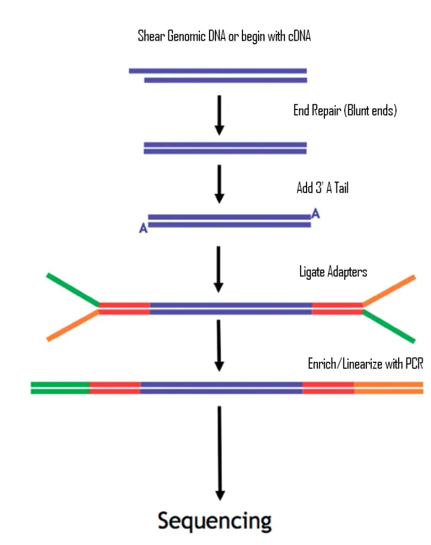
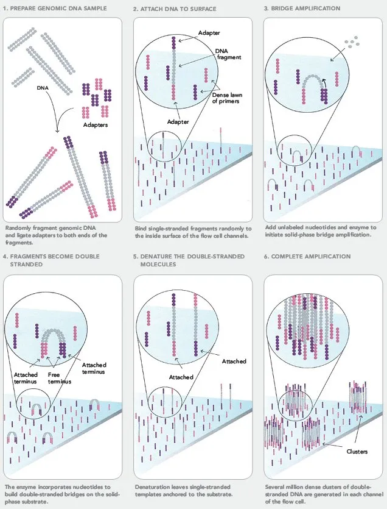
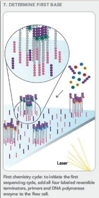
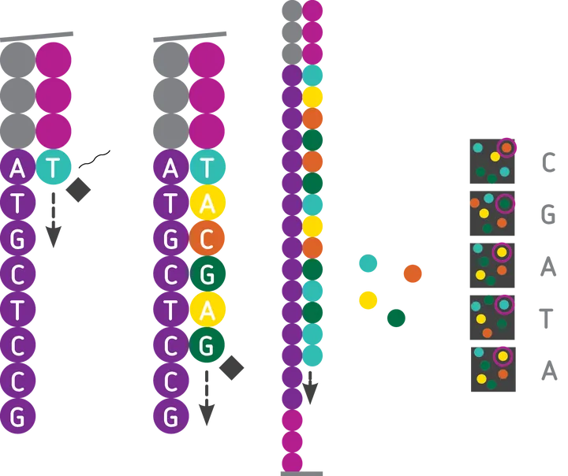
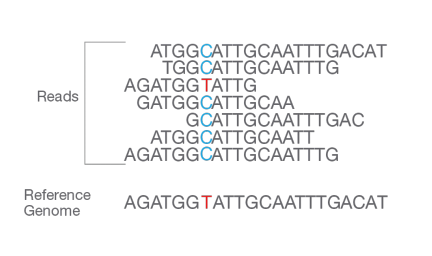
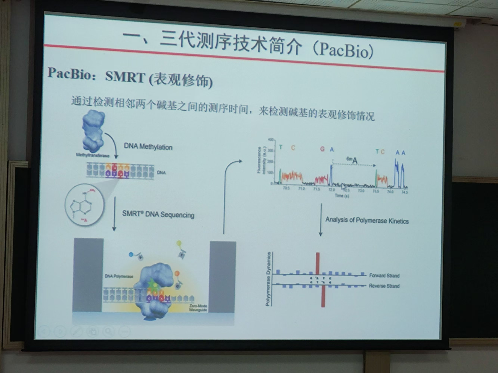

**生物中的遗传信息**[^1]：

1. 一个生物体携带的遗传信息 - 即基因组 - 被记录在 DNA 或 RNA 分子中，分子每个有功能的单位被称作基因。每个基因均由遗传单核苷酸组成。
2. 每个单核苷酸由三部分组成：碱基、戊糖（DNA 中为脱氧核糖，RNA 中为核糖）和磷酸。
3. 碱基不同构成了不同的单核苷酸。组成 DNA 的碱基由腺嘌呤 (A), 鸟嘌呤 (G), 胞嘧啶 (C) 及胸腺嘧啶 (T)。组成 RNA 的碱基以尿嘧啶 (U) 代替了胸腺嘧啶 (T)。

**基本原理**：利用 A、T、C、G 四种碱基的信号差异（可以是光信号、电信号等）进行检测。

**现阶段测序方法**：一代测序（又称 Sanger 测序）、二代测序 和 三代测序。

这个博客主要介绍二代测序中的 Illumina 测序技术和三代测序技术基本原理。

## 二代测序：NGS技术

Illumina 测序技术包括以下四个步骤：

1. DNA 文库制备——超声波断裂加接头；
2. Flowcell——吸附流动 DNA 片段；
3. 桥式 PCR 扩增与变性——放大信号；
4. 测序——测序碱基转化为光学信号。

### 1 超声波断裂加接头[^2]

- **Step 0**: DNA 序列是很长的，Illumina 技术首先使用超声波将 DNA 序列断裂成 300-500 bp 的长度；
- **Step 1**: 断裂之后末端会出现不平整的情况，用酶补平，变成平末端（如下图[^3]）；
- **Step 2**: 完成补平后，在 3’ 端使用酶加上一个特异的碱基 A；然后利用互补配对原则，加上 adapter，这个 adapter 可以分为两部分，一个部分是*<u>测序的时候需要用的引物序列</u>*，另一部分是*<u>建库扩增时需要用的引物序列</u>*。
- **Step 3**: 进行 PCR 扩增，使 DNA 浓度达到上机要求。

### 2 吸附流动 DNA 片段和 PCR 扩增

- **Step 1**：将加好接头的 DNA 阳性加入到 flowcell 中，再加入特异的化学试剂，使得序列的一段与 flowcell 上面已经存在的端序列通过化学键相连。
- **Step 2**: 进行桥式 PCR 扩增，如下图所示[^3]，形成一个个相同序列的 cluster（此时包含反向的序列片段）。

- **Step 3**：冲洗掉反向的扩增序列，使每个 cluster 的序列都是相同的。

### 3 测序

得到一个一个簇之后，通过加入经过特殊处理过的 A,T,C,G 四种碱基进行测序。（这个地方比较有意思）这些碱基有两点特殊的地方：一个是脱氧核糖 3 号位加入了叠氮基团而不是常规的羟基，保证每次只能够在序列上添加 1 个碱基；另一方面是，碱基部分加入了荧光基团，可以激发出不同的颜色。

将荧光的图像信号转化为序列 reads：

这样我们就实现了遗传信息的提取。

## 三代测序

**提出背景**：测序技术经过第一代、第二代的发展，读长从一代测序的近 1000 bp，降到了二代测序的几百 bp，通量和速度大幅提升，那么第三代测序的发展思路在于保持二代测序的速度和通量优势同时，弥补其读长较短的劣势。三代测序与前两代相比，最大的特点就是单分子测序，测序过程无需进行 PCR 扩增。

**基本原理**：使序列经过纳米孔，不同核苷酸通过纳米孔时会产生电信号差异，根据这种差异，使用灵敏的电子设备检验这种信号差异，从而实现对 DNA 的测序。

## 参考文献

[^1]: 维基百科 https://zh.wikipedia.org/zh-cn/%E9%81%97%E4%BC%A0%E5%AF%86%E7%A0%81
[^2]: 知乎 https://zhuanlan.zhihu.com/p/20702684 
[^3]: http://tucf-genomics.tufts.edu/home/faq