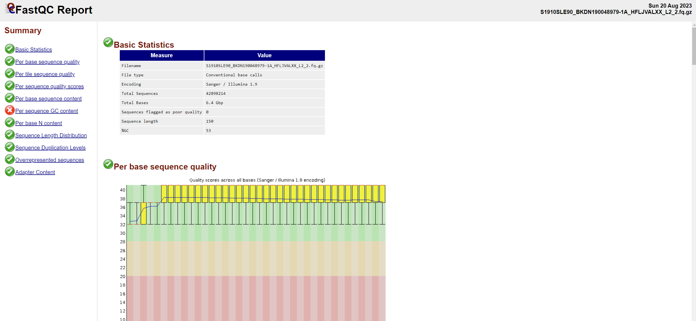
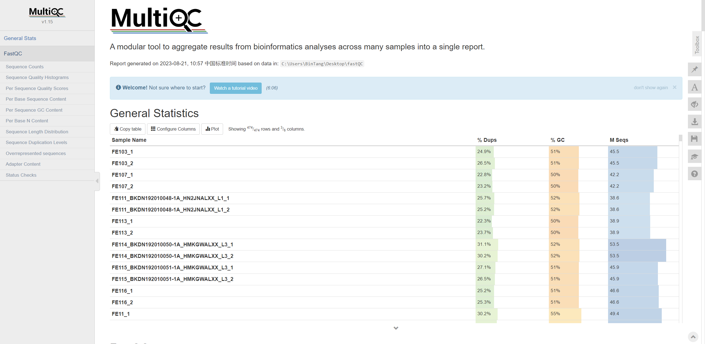
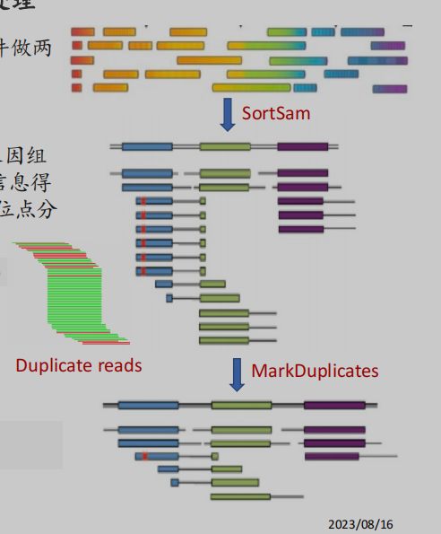
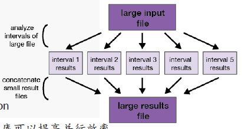

不同代测序的基因组拼接过程都是将测序片段比对到参考基因组的过程，不同点是数据的质控和预处理。这里主要基于二代测序的 Illumina 技术的基因组组装展开。测序后得到的文件是 .fasta[^1] 或 .fastq[^2] 文件，它们记录着测序中每条短 reads 的信息。

人与人之间存在差异的遗传位点非常少，超过 99% 的遗传位点都是一样的，整个 call variants 的过程，**简单地概括就是将 Sample 跟参考基因组 Reference 进行比对，得到样本的基因组信息，记录存在遗传变异的位点。** 这个过程包括质控、序列比对、SNP 和结构变异检测等下游分析：

1. 将 reads 进行质控、滤除接头等预处理
2. 将 reads 映射到参考基因组
3. 根据 reads 进行 SNP 和结构变异检测等下游分析

下面我用 pmgLab 实验室整理的处理流程进行总结，在介绍之前补充两个衡量测序结果的指标：

- **测序深度（Sequencing depth）**[^3]：是指测序得到的碱基总量（bp）与基因组大小的比值，即测序深度 = 数据量大小 / 参考基因组大小。或者理解为基因组中每个碱基被测序到的平均次数。
- **测序覆盖度（Sequencing coverage）**：是指测序获得的序列占整个基因组的比例。或者可以理解为基因组上至少被检测到 1 次的区域占整个基因组的比例。

## 运行环境

### 1 参考基因组与数据库资源

这些数据库都可以在 FTP 仓库中下载：https://hgdownload.soe.ucsc.edu/goldenPath/hg38/bigZips/ 和 https://ftp.broadinstitute.org/bundle/hg38/，还需要下载/构建其索引文件。

| 数据库     | 描述                                                         | HPC 路径                                                     |
| ---------- | ------------------------------------------------------------ | ------------------------------------------------------------ |
| 参考基因组 | 参考基因组 Fasta 文件                                        | /public1/data/resources/ref_genome/hg38/ucsc.hg38.fa         |
| dbSNP      | dbSNP 数据库收集了已知的 SNP 和短缺失/插入变异. 它可以帮助识别已知的常见变异 | /public1/data/resources/ref_variant/hg38/dbsnp_146.hg38.vcf.gz |
| 1kgSNP     | 1000 Genomes 项目发现的单核苷酸多态性(SNP) 变异, 包含不同人群的已知常见 SNP | /public1/data/resources/ref_variant/hg38/1000G_phase1.snps.high_confidence.hg38.vcf.gz |
| Omni       | 1000 Genomes 项目基于 Illumina Omni 芯片发现的 SNP 变异子集  | /public1/data/resources/ref_variant/hg38/1000G_omni2.5.hg38.vcf.gz |
| Hapmap     | HapMap 项目收集的 SNP、短变异和结构变异                      | /public1/data/resources/ref_variant/hg38/hapmap_3.3.hg38.vcf.gz |
| 1kgINDEL   | 1000 Genomes 项目发现的短缺失和插入变异                      | /public1/data/resources/ref_variant/hg38/Mills_and_1000G_gold_standard.indels.hg38.vcf.gz |

### 2 相关软件

| 软件名   | 描述                                                         | HPC 路径                         |
| -------- | ------------------------------------------------------------ | -------------------------------- |
| FastQC   | 用于对测序数据的质量进行评估, 判断是否适合用于下游分析       | /app/tools/fastqc-0.12.1/fastqc  |
| BWA      | Reads 映射工具, 将测序 reads 映射到参考基因组上, 获得 sam/bam 格式的结果 | /app/tools/bwa-0.7.17/bwa        |
| Samtools | 用于处理 alignments 结果, 可将 sam 转为 bam, 排序, 建立索引等 | /app/tools/samtools-1.9/samtools |
| GATK     | 广泛使用的变异检测工具, 可用于进行质量控制、本地实际再调校, 最终产生变异结果 VCF 文件 | /app/tools/gatk-4.4.0.0/gatk     |
| GBC      | 对 VCF 文件进行质控, 并产生下游分析的基因型文件              | /app/tools/ccf-2.0.jar           |
| KGGSeq等 | 对 VCF/GTB 文件进行综合下游分析 (过滤、注释、遗传图谱解析)   | /app/pmglab/kggseq11/kggseq.jar  |

*Note:* 在 Linux x86_64 平台下安装、配置环境，或者使用 Docker 进行配置. Apple Silicon 无法执行 GenomicsDBImport，参见 [Stack Overflow](https://stackoverflow.com/questions/71750854/why-do-i-recieve-error-java-lang-unsatisfiedlinkerror-cant-load-library-when).

## FastQC: 序列质量评估

获得下机数据（`*.fastq`）后，需要先判断测序质量是否合格。FastQC 是一款用于对高通量测序数据进行质量控制的工具软件。它可以生成 HTML 格式的报告，快速展示序列数据的多个质量指标，帮助用户判断测序数据是否合格。综合这些指标可以对序列质量、组成、污染等方面进行判断，找到存在问题的原因。

| Summary                      | 描述                                                         |
| ---------------------------- | ------------------------------------------------------------ |
| Basic Statistics             | 序列数量及长度等信息统计                                     |
| Per base sequence quality    | 每个位置的碱基质量值分布, 反映序列质量在不同位置的变化, 判断是否存在特定位置质量下降 |
| Per tile sequence quality    | 每个 tile 的序列质量分布, 发现 Illumina 测序中是否存在问题 tile |
| Per sequence quality scores  | 所有序列的平均质量值分布, 判断整体 SEQUENCE 质量水平         |
| Per base sequence content    | 每个位置的 A、T、G、C 组成比例, 检查是否存在位置偏序         |
| Per sequence GC content      | 所有 reads 的 GC 含量分布（正常 50% 左右）                   |
| Per base N content           | 每个位置的 N 碱基含量, 判断是否存在未识别碱基的位置          |
| Sequence Length Distribution | 所有序列的长度分布, 发现意外长度的序列 Reads                 |
| Sequence Duplication Levels  | 重复序列比例, 判断序列复杂度                                 |
| Overrepresented sequences    | 高频序列的含量, 反映序列库复杂度                             |
| Adapter Content              | 是否存在接头污染                                             |

每个模块的异常诊断指南请参阅官方文档[^4].



当有多个文件需要分析时，可以使用 `multiqc` 来同时查看多个 FastQC 的信息：

```shell
# 安装
pip3 install multiqc

# 在包含 fastqc 输出结果的目录下执行
multiqc .
```



*Note:* 外显子测序的 GC 含量可能出现异常，在 40% 到 60% 之间，也可以接受.

## 映射 reads 到参考基因组

### 1 参考基因组

人类基因组包括 23 对染色体，其中 22 对是常染色体（chr1-chr22），一对性染色体（chrX，chrY）和线粒体 DNA(mtDNA)。高通量测序的 reads 比对至参考基因组是后续分析的基础。因此，参考基因组的质量至关重要。目前，广泛使用的版本：

1. **hg19，也称为 GRCh37**，发布于 2009 年，是人类参考基因组的第 19 个版本。它被广泛使用于基因测序、变异检测和基因关联研究等领域.

2. **hg38，也称为 GRCh38**，发布于 2013 年，是人类参考基因组的第 38 个版本。它相比于 hg19 有重大改进，hg38 是更加完整和准确的版本.

   两者在绝大部分基因组序列（约 99.9%）上是高度一致的.

### 2 Bwa mem：映射 reads 到参考基因组

下机数据 .fastq 文件包含了测序仪器输出的原始序列读数（reads, “ATTCCGACTTAGGGCACGT” 这样的序列)。这些 reads 的长度一般在 50-300 bp，其中记录了每个碱基的序列信息及其质量值，一个测序实验通常会生成上亿甚至上千亿条 reads，它们在长度和质量上具有一定的分布统计特征.

BWA（Burrows-Wheeler Aligner）是一种用于将短 reads 映射到参考基因组的快速且精确的序列比对工具。操作命令：

```shell
${bwa} mem -t ${threads} -R '@RG\tID:${ID}\tPL:illumina\tLB:${LB}\tSM:${SM}' ${ref.fasta} ${input.fastqs} | ${samtools} view -S -b - > ${output}.bam

# ${bwa}: BWA 工具路径
# mem：使用 bwa 的 mem 算法进行序列比对
# -R '@RG\tID:${ID}\tPL:illumina\tLB:${LB}\tSM:${SM}':这是读取组信息,用于标记 reads 的来源,需要填入实际的值 (通常可以都设置为样本名)
# ${ref.fasta}: 参考基因组序列文件
# ${input.fastqs}: 待比对的 reads 文件, 可能是单端或成对的两端 reads

# 转换为 .bam 文件 ####################################
# |:将上一步的标准输出通过管道作为输入传给下一步
# samtools view: 使用 samtools 查看 bwa 输出的 SAM 文件
# -S: 输入是 SAM 格式
# -b: 输出为 BAM 格式
# - > ${output}.bam: 将标准输出以 BAM 格式写入指定输出文件
```

*Note:* BAM 文件记录了 reads 比对到参考基因组的详细信息，是一种二进制文件，我们只能通过 samtools 这种特定的工具转换后才能查看[^5].

## .BAM 文件预处理

在进行后续分析之前，我们需要对 bwa 比对完成的 .BAM 文件做两个预处理，生成更简洁、可靠的 BAM 文件：



### 1 SortSam

这一步对 BAM 文件中的 reads 进行排序，按照它们的参考基因组上的坐标顺序排列。排列的意义在于可以让 reads 的位置信息得以保存，提高访问速度，使我们更方便基于坐标进行后续的位点分析.

```shell
${gatk} SortSam -I ${input}.bam -O ${output}.bam --SORT_ORDER coordinate

# --SORT_ORDER coordinate: 按照坐标顺序排序(coordinate)
```

### 2 MarkDuplicates

这个过程是去除 BAM 文件中的重复 reads.

```shell
${gatk} MarkDuplicates -I ${input}.bam -O ${output}.bam -M ${output}.txt -R ${ref.fasta} --CREATE_INDEX true --VALIDATION_STRINGENCY SILENT

# --CREATE_INDEX true: 为输出的 BAM 文件创建索引
# --VALIDATION_STRINGENCY SILENT: 忽略警告信息
```

## 校正碱基质量得分

进行二代测序的数据分析时，碱基的质量非常重要。比如测序识别到的一个位点，其碱基和参考基因组上的碱基不同，但是其质量值特别低，此时可以认为是一个测序错误，而不是一个 SNP 位点.

原始碱基质量分数往往不能很好地反映实际的碱基错误率。这是因为不同的测序平台和化学本身就存在系统性误差，导致某些碱基质量分数被高估或低估了，在获取测序 reads 并将其 mapping 到参考基因组后，需要进行质量校正，也就是 Base Quality Score Recalibration(BQSR).其中包含两个步骤[^6]:  

可以使用单个样本和多个样本建立重校准表，但**推荐使用单个样本的 bam 文件产生重校准表：**

1. BaseRecalibrator：这一步根据已知的变异位点，重新计算每个碱基的错误率，建立相关性模型，产生重校准表，得到一个报告文件.

   ```shell
   ${gatk} BaseRecalibrator -I ${input}.bam -R ${ref.fasta} \
   --known-sites ${kgSNP} \
   --known-sites ${kgINDEL} \
   --known-sites ${dbSNP} \
   -O ${bqsr}.table
   # 对多个 bam 同时 BQSR 时，可以使用多个 -I 传入文件
   
   ```

2. ApplyBQSR：这一步利用上一步得到的报告，对所有碱基调用进行质量得分的重新校准.

   ```shell
   ${gatk} ApplyBQSR \
   -R ${ref.fasta} \
   -I ${input}.bam \
   --bqsr-recal-file ${bqsr}.table \
   -O ${output}.bam
   # 对多个 bam 同时 BQSR 时，使用上面产生的 table 分别执行
   ```

## Call Variants (个体水平)

> 前面的都是测序文件的预处理，到这里开始正式 call variants

我们主要关注样本基因组与参考基因组不同的那些区域，也就是存在变异的区域。查找这些变异区域的过程称为变异检测或变异调用（variant calling）。HaplotypeCaller 正是完成变异检测的工具，它通过构建单倍型的方式找出样本相对于参考的变异位点。输出文件是包含单个个体的 GVCF 文件[^7]: 

```shell
${gatk} HaplotypeCaller \
-R ${ref.fasta} \
-I ${input}.bam \
-O ${output}.g.vcf.gz \
-G StandardAnnotation \
-G StandardHCAnnotation \
-G AS_StandardAnnotation \
-GQB 10 -GQB 20 -GQB 30 -GQB 40 -GQB 50 \
-GQB 60 -GQB 70 -GQB 80 -GQB 90 \
-ERC GVCF

# -R ${ref.fasta}: 参考基因组序列文件
# -I ${input}.bam: 输入需要进行变异检测的 BAM 文件
# -O ${output}.g.vcf.gz: 输出 GVCF 格式压缩变异调用结果
# -G: 指定使用的注释组,添加变异注释信息
# -GQB: 基因型质量分数下限,增量设置多个阈值进行过滤
# -ERC GVCF: 输出符合 GVCF 标准的结果
```

## Call variants (群体水平)

GenotypeGVCFs 的目的是通过合并多个样本的变异信息，获得更准确的联合变异检测结果，它需要先使用 GenomicsDBImport 构建群体基因组数据库，再执行 calling.为了提高并行效率，通常建议单个染色体进行 calling，使用 MergeVcfs 合并.

```shell
${gatk} GenomicsDBImport \
-V ${input1}.g.vcf.gz \
-V ${input2}.g.vcf.gz \
-V ${input3}.g.vcf.gz \
...
--reader-threads 4 \
--genomicsdb-workspace-path genomicsDB_import/chr1 \
-L chr1


${gatk} GenotypeGVCFs \
-R {ref.fastq} \
-V gendb://genomicsDB_import/chr1 \
-O chr1.hg38.vcf.gz \
-D ${dbSNP} \
-G StandardAnnotation -G AS_StandardAnnotation

# -L chr1: 按照每个染色体单独建库, 单独建库可以提高并行效率。
# -D:指定dbSNP数据库用于注释。
# -G:变异注释参数。

# 最终合并
${gatk} MergeVcfs\
-I chr1.hg38.vcf.gz \
-I chr2.hg38.vcf.gz \
-I chr3.hg38.vcf.gz \
-I chr4.hg38.vcf.gz \
…
-O all.hg38.vcf.gz
```




## 重新校正位点质量得分

在初步 call variants 完成后, 还需要对变异进行质量重新评估, 也就是**Variant Quality Score Recalibration (VQSR)**.目的是对变异位点进行质量控制, 识别出假阳性结果; 提高变异检测的特异性.其包含两个步骤:

1. VariantRecalibrator：这一步使用已知的真阳性变异位点作为训练集,计算每个变异位点的质量特征,训练出质量评分模型.

   ```shell
   /app/tools/gatk-4.4.0.0/gatk VariantRecalibrator 
   -R /public1/data/resources/ref_genome/hg38/ucsc.hg38.fa
   -V apply_VQSR/SNP.hg38.vcf.gz 
   --max-gaussians 4 
   --resource:mills,known=false,training=true,truth=true,prior=12.0 /public1/data/resources/ref_variant/hg38/Mills_and_1000G_gold_standard.indels.hg38.vcf.gz 
   -resource:dbsnp,known=true,training=false,truth=false,prior=2.0 /public1/data/resources/ref_variant/hg38/dbsnp_146.hg38.vcf.gz 
   -an QD -an DP -an FS -an SOR -an ReadPosRankSum -an MQRankSum 
   -mode INDEL 
   -O variant_reclibrate/raw.snp.indel.recal 
   --tranches-file variant_reclibrate/raw.snp.indel.tranches
   ```
   
2. ApplyVQSR：这一步则利用训练得到的质量评分模型, 对全部变异进行质量过滤, 移除假阳性结果.

    ```shell
    /app/tools/gatk-4.4.0.0/gatk ApplyVQSR 
    -R /public1/data/resources/ref_genome/hg38/ucsc.hg38.fa 
    -V apply_VQSR/SNP.hg38.vcf.gz 
    -O SNP.INDEL.hg38.vcf.gz 
    --truth-sensitivity-filter-level 99.0 
    --tranches-file variant_reclibrate/raw.snp.indel.tranches 
    --recal-file variant_reclibrate/raw.snp.indel.recal 
    -mode INDEL
    ```

进行 VQSR 的目的是清除假阳性变异,获得更可靠的变异结果集.它通过机器学习实现对变异检测结果的质控, 是 GATK 推荐的最佳实践之一.

VQSR 对于 SNP 和 INDEL 配置的参数不同，一般建议先对合并的 VCF 文件进行 SNP 水平的 VQSR，生成 SNP.vcf.gz，然后再对 SNP.vcf.gz 进行 INDEL 水平的 VQSR，生成最终文件[^8].

*Note:* 注意区分 BQSR 和 VQSR，一个是校正碱基，一个是校正变异位点.


## Reference

[^1]: https://en.wikipedia.org/wiki/FASTA_format
[^2]: https://en.wikipedia.org/wiki/FASTQ_format
[^3]: https://zhuanlan.zhihu.com/p/40040208
[^4]: https://www.bioinformatics.babraham.ac.uk/projects/fastqc/Help/3%20Analysis%20Modules/
[^5]: https://cloud.tencent.com/developer/article/1624543
[^6]: https://zhuanlan.zhihu.com/p/478898378
[^7]: https://blog.csdn.net/weixin_49533584/article/details/123663996
[^8]: https://gatk.broadinstitute.org/hc/en-us/articles/360035531612-Variant-Quality-Score-Recalibration-VQSR-GATKVQSR:


 
