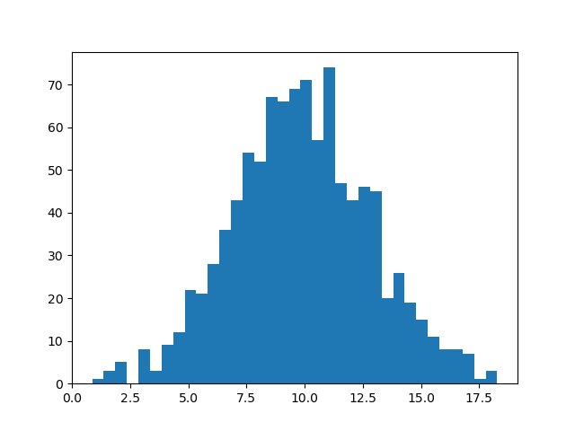

## 蒙特卡洛法的应用

### 1 计算面积

**计算面积**：蒙特卡洛法计算面积是很常见的应用，比如在正方形中计算扇形的面积


**计算简单积分**：**积分**其实就是一条曲线与坐标轴之间围成的面积，因此也可以用蒙特卡洛来计算积分，比如下面，我们只需要找到一个包围这条曲线的一个正方形，就可以”撒豆子“确定两个面积的比例计算出积分。


**本质是随机“撒豆子”，随机抽样是蒙特卡洛法的核心**。对于体积等更高维的计算，也可以使用同样的方法。蒙特卡洛法通过撒豆子建立圆(未知)面积和正方形(已知)面积的比例，从而计算出圆(未知)的面积。利用比例变化，还可以利用蒙特卡洛法构造新的抽样分布。

### 2 特定分布抽样

**自定义分布抽样**：我们现在可以使用的随机数都是一些常见的分布，比如均匀分布、正态分布等等，如果有一天需要生成密度函数 $p(x) \propto e^{-x^2/2},x\in(0,1)$ 的随机数怎么办呢？蒙特卡洛法也可以做到这种情况的抽样，最常用的一种方法是 **接受拒绝法**，如下：

> 输入：抽样的目标概率分布的概率密度函数 $p(x)$ ；
> 输出：概率分布的随机样本 $x_1,\cdots,x_n$.
> 参数：样本数 n
>
> 1. 选择概率密度函数为 $q(x)$ 的概率分布，作为建议分布，使其对任一 $x$ 满足 $cq(x) \ge p(x)$ ，其中 $c > 0$.
> 2. 按照建议分布 $q(x)$ 随机抽样得到样本 $x^\ast$，再按照军与分布在 $(0,1)$ 范围内抽样得到 $u$.
> 3. 如果 $u \le \frac{p(x^\ast)}{cq(x^\ast)}$，则将 $x^\ast$ 作为抽样结果；否则回到步骤2.
> 4. 直到得到 $n$ 个随机样本，结束。

这个算法对应下面的图，类比计算面积时的”撒豆子“，在建议分布中 $x^\ast$ 的概率密度为 $q(x^\ast)$ ，$cq(x^\ast)$已知，通过比例让在 $x^\ast$ 接受的概率为 $p(x)$ ，也就是我们的目标概率密度函数，根据控制接受比例 $\frac{p(x^\ast)}{cq(x^\ast)}$，确保最终抽样符合我们指定的分布函数。


### 4 计算复杂积分

通过接受-拒绝法，我们可以生成各种函数作为密度函数($p(x)$)的随机抽样，而样本最常用的一个指标就是期望，因此我们可以计算出密度函数 $p(x)$ 对应分布的期望：


$$
E(x) = \int xp(x) dx \approx \frac{1}{n} \sum_i x_i
$$


其中 $x_i$ 为抽样样本。期望其实也是一种积分，我们可以将每个函数都变为求期望的形式，比如我们要对 $h(x)$ 求积分，我们可以先把 $h(x)$ 分解为 $h(x) = g(x) p(x)$，其中 $p(x)$ 是某个分布的密度函数（只要让 $g(x) = h(x)/p(x)$ ，进行分解），那么对 $h(x)$ 的积分就变为


$$
\int h(x) dx = \int g(x) p(x) dx
$$


右边就是期望 $E(g(x))$ 的积分表达式。

**我们可以利用抽样的方式来计算更复杂的积分**，可以根据密度函数 $p(x)$ 抽样得到 $x_i$ ，然后计算 $g(x_i)$，最后可以估计积分


$$
\int h(x) dx = \int g(x) p(x) dx = E(g(x)) \approx \frac{1}{n}\sum_i g(x_i)
$$


接受-拒绝法很强大，但它也有很大的局限性：每一次抽样都有可能被拒绝，如果拒绝的比例很高，那么抽样效率会非常低。马尔科夫链蒙特卡洛法就是为了解决这个问题。

## 马尔科夫链蒙特卡洛法

一般在介绍马尔科夫链蒙特卡洛法之前会介绍马尔科夫链的各种性质，比如定义、转移概率矩阵、可约、周期和平稳等等，这些内容多很专业，我不准备在这里介绍这个（我也不是很懂），想了解的可以查阅相关资料，对于是否了解马尔科夫链并不会影响我们对马尔科夫链蒙特卡洛法相关方法运用。我们是利用它的结论性质：**马尔科夫链达到稳定状态后，随机生成的样本会服从目标分布。**

在此我介绍马尔科夫链蒙特卡洛法的 Metropolis-Hastings(M-H) 算法，我这里直接上算法结论，原理在李航老师统计学习方法介绍很详细（我觉得先用起来，感觉它很有意思之后再去看原理会有信心一些 :happy: ）

> 输入：抽样的目标分布的密度函数 $p(x)$，函数 $f(x)$;
> 输出：$p(x)$ 的随机样本 $x_{m+1},x_{m+2},\cdots,x_n$，函数样本均值 $f_{mn}$；
> 参数：收敛步数 $m$，迭代步数 n.
>
> 1. 任意选择一个初始值 $x_0$
>
> 2. 对 $i=1,2,\cdots,n$ 循环执行
>
>    1. 设状态 $x_{i-1} = x$，按照建议分布 $q(x,x')$ 随机抽取一个候选状态 $x'$。
>
>    2. 计算接受概率
>       
>$$
>   \alpha(x,x') = \min\{ 1,\frac{p(x')q(x',x)}{p(x)q(x,x')} \}
> $$
> 
>
>   3. 从区间 $(0,1)$ 中按均匀分布随机抽取一个数 $u$. 若 $u \le \alpha(x,x')$, 则状态 $x_i = x'$；否则，状态 $x_i = x$.
> 
>3. 得到样本集合 $\{ x_{m+1},x_{m+2},\cdots,x_n \}$, 计算 $f(x)$ 均值。

对于 M-H 算法，最主要的核心在于建议分布 $q(x,x')$ 的选取，建议分布有很多种形式，这里我总结了书上的两种形式：

- **建议分布是对称的**，这样的建议分布称为 Metropolis 选择，也是 Metropolis-Hastings 算法最初采用的建议分布。这可以将接受概率中的建议分布抵消掉，简化接受分布。例如多元正态分布、$q(x,x') = q(\lvert x-x'\rvert)$ 等都是对称分布。**它的特点是** $x'$ 与 $x$ 接近时接受概率高，向附近转移的可能性大。即对任意的 $x$ 和 $x'$ 有


$$
q(x,x') = q(x',x)
$$


- **建议分布是独立抽样**，假设 $q(x,x')$ 与当前状态 $x$ 无关，即 $q(x,x') = q(x')$。独立抽样简单，但可能收敛速度较慢，**通常选择接近目标分布 $p(x)$ 的分布作为建议分布 $q(x)$**

使用 M-H 算法取代 接受-拒绝法 生成样本，然后可以更高效的计算积分。

可以发现使用M-H算法，只是丢弃了前面 $m$ 个样本，达到平稳之后的每个样本都会被接受，相比接受拒绝法效果要好很多。这里其实也引出了一个新问题——m个样本具体是多少呢，这其实没有答案，**通常会设置一个可以接受的比较大的值，再严格点会同时生成几条链，最后比较几条链是否存在差异判断是否稳定。**

这里我就只介绍到 M-H 算法了，对于高维的 单分量 M-H 算法和 吉布斯抽样，方法原理与 M-H 方法差不多。

## python 实现

这里给出一个实际分析中例子，使用均匀分布 `random.random()` 模拟高斯分布。

- 使用接受拒绝法模拟标准正态分布；
- 使用MH算法模拟标准正态分布；
- 使用单分量 MH 算法模拟 5 维高斯分布 (略)；
- 使用吉布斯抽样模拟 5 维高斯分布 (略)；

使用上面模拟出来的分布计算任何区间内的高斯分布积分。


$$
f(x) = \frac{1}{\sqrt{2\pi}}\exp{-\frac{x^2}{2}}
$$


### 拒绝法

拒绝法的模拟需要找到一个建议分布，定义域上的范围至少要包含需要模拟的分布，所以我要找到的那个分布也要是定义域为整个实数域的分布，而均匀分布的定义域为整个实数域，那就会有问题了，所以这里我只模拟高斯分布 $[-10,10]$ 这个范围。（这个范围足够大，可以近似看作高斯分布，这个找建议分布也算是拒绝法的一个局限性吧）

1. 选择建议分布 $q(x) =\frac{1}{20},\ x\in [-10,10]$，计算满足 $cq(x) \ge f(x)$ 常数 c，显然 $c = \frac{20}{\sqrt{2\pi}}$ 满足
2. 按照建议分布 $q(x)$ 得到随机样本 $x^\ast$ ，并按照$(0,1)$ 的均匀分布得到 $u$ 
3. 如果 $u \le \frac{f(x)}{cq(x)}$ 则接受 $x^\ast$ 作为抽样结果，否则回到 2
4. 直到抽样 n 个样本结束

```python
import numpy as np
import pandas as pd


def MonteCarlo_reject(f, q, c, N=1000):
    i = 0
    X = [None] * N
    while 1:
        # 生成
        x_ = (np.random.random() - 0.5) * 20 # 与 q 有关的一个分布，只计算了-10 --- 10
        u = np.random.random()
        # 判断是否接受
        if u <= f(x_) / (c * q(x_)):
            X[i] = x_
            i += 1
        if i >= N:
            break
    return X


# 统一接口
def frequency_chart(x):
    import numpy as np
    import pandas as pd

    import matplotlib.pyplot as plt
    import seaborn as sns

    sns.set_theme(style="darkgrid")

    xlabel, = x.columns
    sns.histplot(data=x, x=xlabel, bins=int(np.sqrt(len(x))))
    plt.show()


if __name__ == '__main__':
    N = 10000  # 样本个数

    # 所需分布的分布函数f(x)
    f = lambda x: 1 / np.sqrt(2 * np.pi) * np.exp(- x ** 2 / 2)

    # 建议分布 q(x)，建议分布是用于获得样本 x^*的
    q = lambda x: 1 / 20
    c = 20 / np.sqrt(2 * np.pi)

    frequency_chart(pd.DataFrame(MonteCarlo_reject(f, q, c, N)))
```


### M-H法

输入：抽样的目标分布的密度函数 $p(x)$，函数 $f(x)$;
输出：$p(x)$ 的随机样本 $x_{m+1},x_{m+2},\cdots,x_n$，函数样本均值 $f_{mn}$；
参数：收敛步数 $m$，迭代步数 n.

1. 任意选择一个初始值 $x_0$

2. 对 $i=1,2,\cdots,n$ 循环执行

   1. 设状态 $x_{i-1} = x$，按照建议分布 $q(x,x')$ (**q表示 $x$ 转移到 $x’$ 的概率，下面构造的 $\alpha$ 就是平稳分布**)随机抽取一个候选状态 $x'$。

   2. 计算接受概率
      
      
      $$
      \alpha(x,x') = \min\{ 1,\frac{p(x')q(x',x)}{p(x)q(x,x')} \}
      $$


   3. 从区间 $(0,1)$ 中按均匀分布随机抽取一个数 $u$. 若 $u \le \alpha(x,x')$, 则状态 $x_i = x'$；否则，状态 $x_i = x$.

3. 得到样本集合 $\{ x_{m+1},x_{m+2},\cdots,x_n \}$, 计算 $f(x)$ 均值。

```python
import numpy as np
import pandas as pd
from scipy import stats


# 对称分布
def MonteCarlo_MH(x0, f, N=1000, stable_N=10000):

    X = [None] * (N + stable_N)
    X[0] = x0
    i = 1

    while 1:

        x_ = (np.random.random() - 0.5) * 10  # 与 q 有关

        alpha = lambda x, x_: min(1, f(x_) / f(x))  # 计算接受概率，对称分布的时候 q抵消掉了
        u = np.random.random()

        if u <= alpha(X[i - 1], x_):
            X[i] = x_
        else:
            X[i] = X[i-1]

        i += 1
        if i >= N + stable_N:
            break
    return X[stable_N:]


def frequency_chart(x):
    import numpy as np
    import pandas as pd

    import matplotlib.pyplot as plt
    import seaborn as sns

    sns.set_theme(style="darkgrid")

    xlabel, = x.columns
    sns.histplot(data=x, x=xlabel, bins=int(np.sqrt(len(x))))
    plt.show()


if __name__ == '__main__':
    N = 10000  # 样本个数

    # 所需分布的分布函数f(x)
    f = lambda x: 1 / np.sqrt(2 * np.pi) * np.exp(- x ** 2 / 2)

    # 建议分布 q(x)，建议分布是用于获得样本 x^*的
    q = lambda x: 1 / 20  # 使用对称分布 -10 到 10

    stable_N = 500
    frequency_chart(pd.DataFrame(MonteCarlo_MH(0,f,N)))

```


## 应用-对后验分布抽样

MCMC 我在很早之前就有所了解，但真正让我开始学习MCMC是因为在学习贝叶斯统计的时候，学过贝叶斯统计的人都知道，除了几个共轭先验分布的后验分布好计算，其它的基本上别想算解析解，这也是我来学习 MCMC 的原因。


一般的 MCMC 教程上都是以积分计算为例子，我一度以为 MCMC 的核心是计算积分，对应到贝叶斯统计中是计算后验分布 $\pi(\theta\vert x) = \frac{p(x\vert \theta)\pi(\theta)}{\int p(x\vert \theta)\pi(\theta) dx}$ 中分母的这个积分，直到我弄懂了 MCMC 可以直接对后验分布抽样弄明白，它的核心在**抽样**。

首先我们再来看到 M-H 算法


> **算法（Metropolis-Hastings ）**
>
> 输入：抽样的目标分布的密度函数 $p(x)$，函数 $f(x)$;
> 输出：$p(x)$ 的随机样本 $x_{m+1},x_{m+2},\cdots,x_n$，函数样本均值 $f_{mn}$；
> 参数：收敛步数 $m$，迭代步数 n.
>
> 1. 任意选择一个初始值 $x_0$
>
> 2. 对 $i=1,2,\cdots,n$ 循环执行
>
>    1. 设状态 $x_{i-1} = x$，按照建议分布 $q(x,x')$ 随机抽取一个候选状态 $x'$。
>
>    2. 计算接受概率
>       
>$$
> \alpha(x,x') = \min\{ 1,\frac{p(x')q(x',x)}{p(x)q(x,x')} \}
> $$
> 
>
>   3. 从区间 $(0,1)$ 中按均匀分布随机抽取一个数 $u$. 若 $u \le \alpha(x,x')$, 则状态 $x_i = x'$；否则，状态 $x_i = x$.
> 
>3. 得到样本集合 $\{ x_{m+1},x_{m+2},\cdots,x_n \}$, 计算 $f(x)$ 均值。


需要使用 M-H 算法，得先知道密度函数，我想对后验分布进行抽样，那我得知道后验密度函数 $\pi(\theta\vert x)$ ，但它我们并不知道，我们只能根据贝叶斯公式知道它与样本($x$)和先验分布($p(x)$)之间的关系:


$$
\pi(\theta|x) = \frac{p(x|\theta) \cdot \pi(\theta)}{\int p(x|\theta) \cdot \pi(\theta) d\theta} \propto p(x|\theta) \cdot \pi(\theta)
$$


其实只要知道这个关系就足够了，因为预设的这个密度函数只影响接受概率 $\alpha$ ，而我们在知道后验密度函数的核，可以计算出接受概率。所以我们可以将 M-H 算法的接受概率改为（如果没有理解，可以参考最后的例子代码实现）：


$$
\alpha(\theta,\theta') = \min\{ 1,\frac{\pi(\theta'|x)q(\theta',\theta)}{\pi(\theta|x)q(\theta,\theta')} \} = \min\{ 1,\frac{p(x|\theta') \cdot \pi(\theta')q(\theta',\theta)}{p(x|\theta) \cdot \pi(\theta)q(\theta,\theta')} \}
$$


其中 $p(x\vert \theta')$ 和 $p(x\vert \theta)$ 是参数 $\theta$ 和 $\theta'$ 下的观察值对应的密度函数。

### example

假设我们有 1000 个正态分布的一维数据，我们想知道这些数据的方差 $\sigma$ 是多少。

```python
import numpy as np
import matplotlib.pyplot as plt

np.random.seed(0)
population = np.random.normal(10,3,30000) # 均值为10，标准差为3，人群总体为30000
obs = population[:1000] # 我们只有一千的样本量

plt.hist(obs,bins=35)
plt.show()

mu = obs.mean()
sigma0 = obs.std() 
print(mu, sigma0)
```



这里我们假设方差的先验分布为 $\sigma \sim N(\sigma_0,1)$ ，其中 $\sigma_0 = obs.std()$. 样本是服从正态分布：


$$
x|\sigma \sim N(\mu, \sigma)
$$


其中 $\mu$ `= obs.mean()`，因此我们可以得到后验核为


$$
\pi(x|\sigma)\cdot \pi(\sigma) \propto \frac{1}{\sigma}\exp \{- \frac{1}{2}\sum_i(x_i - \mu)^2/\sigma^2 \} \cdot \exp \{ \frac{1}{2} (\sigma - \sigma_0)^2 \}
$$

这么算样本量太多，而且有指数，数值非常大，因此我把它们对数变换一下

```python
f = lambda sigma: -np.log(sigma) * 100 - 1/2 * sum((obs[i] - mu)**2 / sigma**2 for i in range(100)) - 1/2 * (sigma - sigma0)**2
```

下面是 M-H 方法，注意后验密度函数做了对数变换，所以在计算接受概率时也要做密度变换：

```python
def MonteCarlo_MH(theta0, f, N=1000, stable_N=10000):
    # theta0 表示初始值
    # f 表示后验密度函数的核
    # stable_N 表示“燃烧数”，就是平稳之前迭代的次数
    # N 表示需要模拟的样本个数

    Theta = [None] * (N + stable_N)
    Theta[0] = theta0
    i = 1

    while 1:

        theta_ = abs(np.random.normal(Theta[i - 1], 1))  # 建议分布 q，选择一个对称函数 q(x,x') = q(x',x)

        alpha = lambda theta, theta_: min(0, f(theta_) - f(theta))  # 计算接受概率，对称分布的时候 q抵消掉了，对数形式的话这里要改为 f_ - f
        u = np.random.random()

        if u <= np.e ** alpha(Theta[i - 1], theta_):
            Theta[i] = theta_
        else:
            Theta[i] = Theta[i - 1]

        i += 1
        if i >= N + stable_N:
            break
    return Theta[stable_N:]
```

```python
res = MonteCarlo_MH(-1, f,N=1000,stable_N=0)

print("后验分布的均值与标准差",np.mean(res[500:]),np.std(res[500:]))
plt.plot(range(len(res)),res)
plt.show()

# 后验分布的均值与标准差 2.946398134031754 0.05475167149092834 
# （前面不稳定的就是需要丢掉的数，也就是“燃烧”数 m ）
```


## Reference

