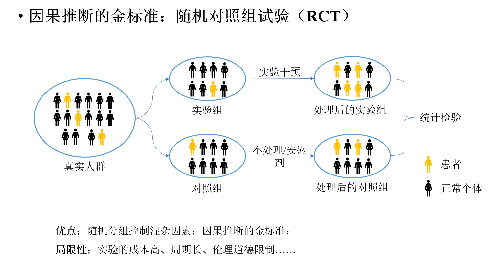
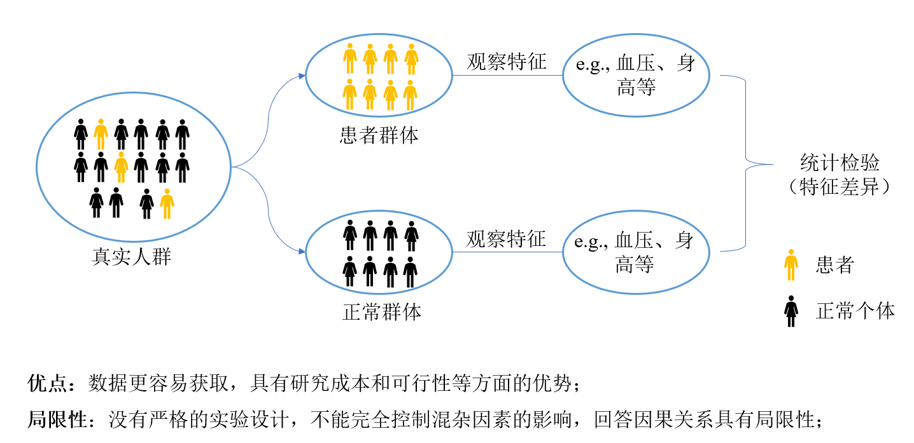
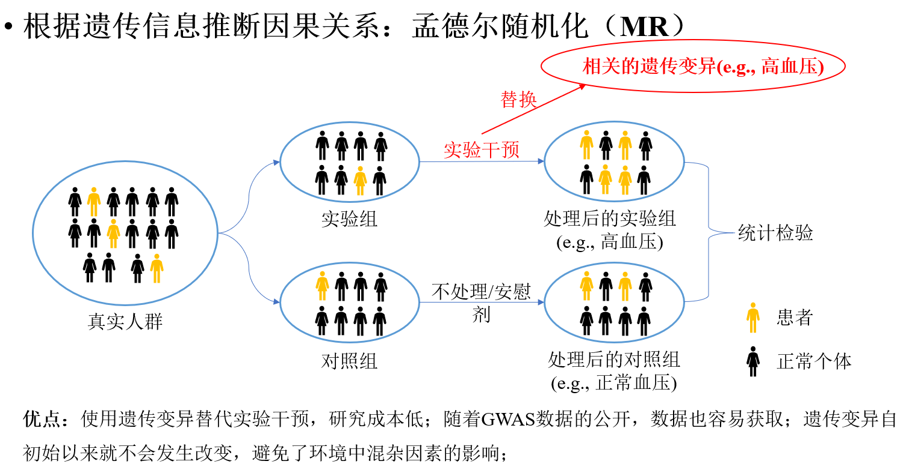
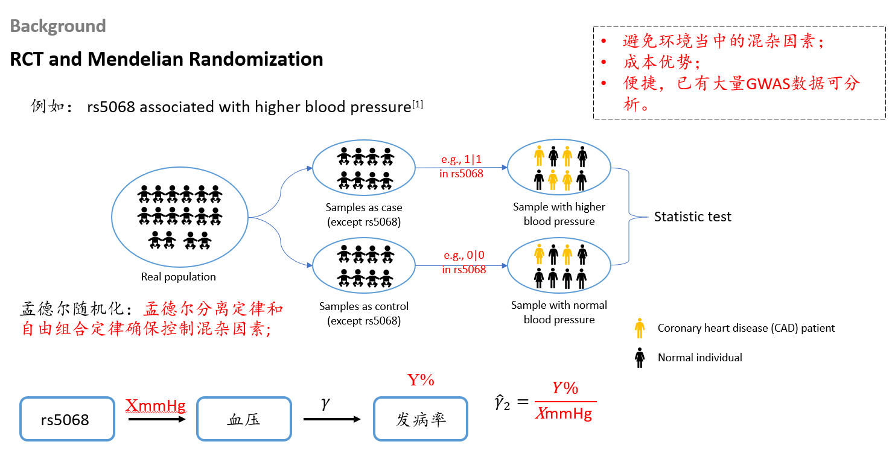

在生物医学领域，一提到因果推断，很多人首先想到的就是**随机对照试验（Randomized Controlled Trial, RCT）**，它被誉为因果推断的金标准。随机对照试验通过随机分组，让对照组和实验组在混杂因素（confounding）上达到平衡。这样一来，如果两组结果出现显著差异，那几乎可以肯定是由实验干预造成的。

随机对照试验的统计分析方法其实很简单，传统的 t 检验、卡方检验就能胜任。这主要得益于它严格的实验设计，产生的数据质量非常高。但RCT的缺点也很明显：成本极其高昂，开展前需要经过伦理审查，而且很多疾病并不适合用它来研究。比如，你不可能把一个病入膏肓的患者分到对照组而不给予治疗。

近十年来，生物医学领域产生了海量的观察性研究数据，比如公开的全基因组关联分析（GWAS）、单细胞测序以及各种组学数据。这些数据没有经过严格的实验设计，虽然体量庞大，但在回答因果关系问题时存在天然缺陷。举个例子，如果我们想研究因素A和因素B之间的关系，虽然可以用多元线性回归等方法校正一些已知的协变量，但总有一些未知的混杂因素是我们无法校正的。**正是为了解决“未知混杂因素下的因果推断”这一难题，孟德尔随机化方法应运而生。**

孟德尔随机化的核心原理，本质上和随机对照试验是一样的。随机对照试验通过人为随机分组来控制混杂因素，而**孟德尔随机化则巧妙地利用遗传变异在传递过程中的随机分离和自由组合（也就是孟德尔定律），天然地实现了“随机分组”的效果，从而控制混杂因素**。这句话对初学者可能有点抽象。记得在一次毕业宴会上，老师用了一个很形象的例子来解释：假设我们要研究血型（A、B、AB、O）是否会影响血压。随机对照试验的做法是，从人群中随机选取不同血型的人，控制好混杂因素，然后比较他们的血压。而**血型完全由遗传变异决定**，所以**孟德尔随机化只需要根据决定血型的遗传变异对人群进行分组，就能达到类似随机对照试验的效果**，再比较不同组的血压，从而推断因果关系。

孟德尔随机化正是通过（与暴露因素相关的）遗传变异来对人群分组，从而像随机对照试验那样，模拟出一个“自然”的干预分组，进而进行因果推断。

下面再举一个更通用的例子。我们都知道血压（blood pressure, BP）会影响冠心病（coronary artery disease, CAD）的发病率，但影响有多大？因果效应具体是多少？孟德尔随机化可以帮我们轻松估算出来。

首先，通过高血压的全基因组关联分析（GWAS），筛选出与高血压相关的遗传变异，比如 `rs5068`。然后，将人群中携带这个遗传变异的个体分为**实验组**，不携带的分为**对照组**。关键在于：**两组除了 `rs5068` 这个遗传位点不同之外，由于遗传变异在传递时是随机分离和自由组合的，其他遗传物质的分布基本相同；而且人从出生起遗传物质就不再改变，所以两组人群受环境的影响也大体一致。这样一来，两组之间的混杂因素就可以看作是被平衡掉了。** 假设携带 `rs5068` 的人群血压比对照组高出 `X` mmHg，我们观察两组最终的冠心病发病率差异，假设为 `Y%`，那么就可以近似估计出：**血压每升高 `X` mmHg，冠心病发病率大约增加 `Y%`**，即因果效应为 $\frac{Y\%}{X\ \text{mmHg}}$。

以上就是孟德尔随机化能够推断因果关系的基本原理。
